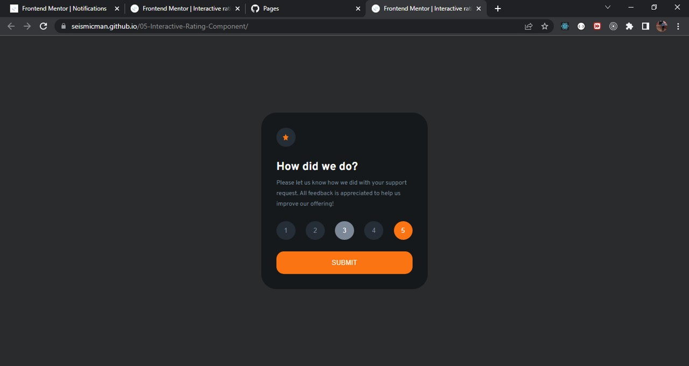
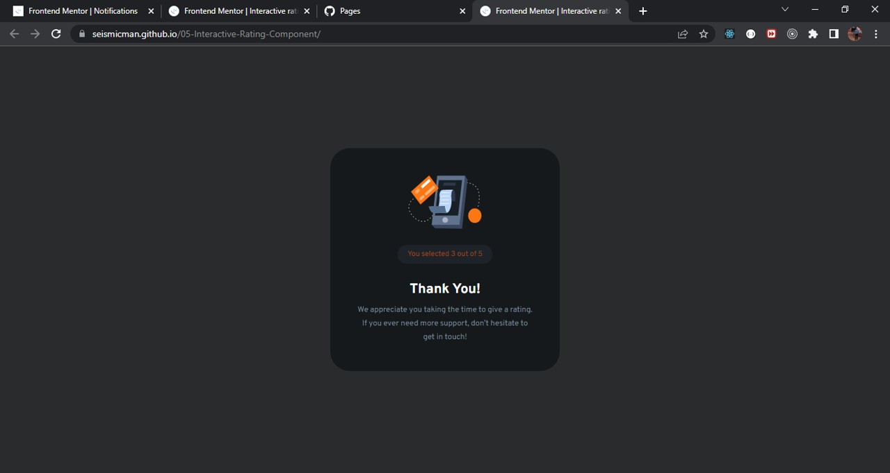

# Frontend Mentor - Interactive rating component solution

This is a solution to the [Interactive rating component challenge on Frontend Mentor](https://www.frontendmentor.io/challenges/interactive-rating-component-koxpeBUmI). Frontend Mentor challenges help you improve your coding skills by building realistic projects.

## Table of contents

- [Overview](#overview)
  - [Screenshot](#screenshot)
  - [Links](#links)
- [My process](#my-process)
  - [Built with](#built-with)
  - [What I learned](#what-i-learned)
  - [Continued development](#continued-development)
  - [Useful resources](#useful-resources)
- [Author](#author)

## Overview

### Screenshot

### Links

Solution URL: [https://seismicman.github.io/02-product-preview-card-component/](https://seismicman.github.io/02-product-preview-card-component/)

## My process

### Built with

- Semantic HTML5 markup
- CSS custom properties
- Flexbox
- [React](https://reactjs.org/) - JS library

### What I learned

Although this is a project that mainly we can develop in HTML and CSS, I developed it in React using two components (Request.jsx and Thank.you.jsx) and CSS for the styles. A lot of learning left this exercise:

- Conditional rendering to switch both components.
- Two state variables to manage the rating and a boolean variable to manage if the user rated or not.
- Active pseudo class in CSS to show as "selected" the rating.
- Props and onclick event to develop the functionality of this challenge.
- Media queries CSS to switch between mobile and desktop versions.

### Continued development

I would like to continue developing this challenges using React as main resource and complementing with other ones as HTML5, CSS, SAAS, among others

### Useful resources

- [www.csstricks.com <- To keep updated about CSS](https://css-tricks.com/) - This an amazing site with a lot of articles about the world of CSS.
- [https://jonmircha.com/cursos <- To learn about frontend resources](https://jonmircha.com/cursos) - This is an amazing spanish channel when do you can learn about HTML5, CSS, React, Git and Github, among others. I'd recommend it to anyone still learning these resources.

## Author

- Frontend Mentor - [@seismicman](https://www.frontendmentor.io/profile/seismicman)
